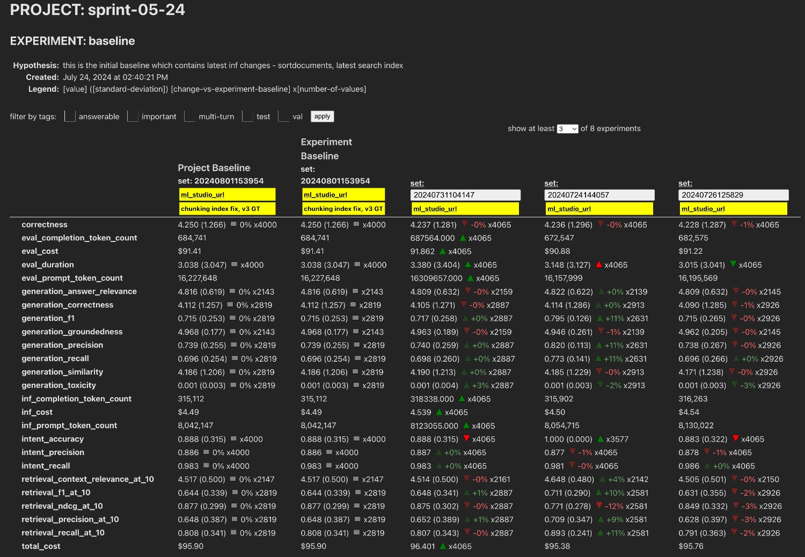

# Experiment Catalog

This repository contains a collection of projects that are helpful for running experiments and then cataloging them for later comparison. These are the four projects:

- [Catalog](./catalog): The catalog is a C# API that allows you to create projects with experiments. It then allows you to record results on arbitrary metrics and compare them.

- [UI](./ui): The UI for the catalog is a Svelte project. The Catalog project above can host this site.

- [Evaluator](./evaluator): The evaluator is a C# pipeline that allows you to run inference and evaluation jobs at high scale without those services needing to understand the catalog, storage, or queuing.

- [Evaluation](./evaluation): The evaluation project is a Python script that serves as an example of using an LLM as a judge to evaluate the quality of a model.

Click on each of those services above to learn more.

## Why?

This project was created because our team found it difficult to compare the results of our experimentation using existing tools. A few benefits of this approach include:

- It is easy to see how specific ground truths performed across multiple runs or experiments.

- Tagging allows us to investigate the performance of specific subsets of ground truth. This is critically important to understand how a model performs across diverse ground truth.

- Separation of project and experiment baselines.

- It is easy to see the number of results for each each metric across run. This is very important to ensure how similar the things being compared are.

- It is fast to get started without metric definitions. When more advanced comparision is needed, definitions can be added.

- It is easy to organize and reorganize as things change.

- Tagging and annotation can be done after the execution of the experiment run allowing for greater flexibility.



## Enqueue Inference

```bash
curl -i -X POST -H "Content-Type: application/json" -d '{ "project": "project-01", "experiment": "experiment-000", "set": "both", "containers": ["test"], "queue": "pelasne-inference", "iterations": 3 }' http://localhost:6030/api/evaluations
```

## Code of Conduct

[Microsoft Open Source Code of Conduct](./CODE_OF_CONDUCT.md)

## Trademarks

This project may contain trademarks or logos for projects, products, or services. Authorized use of Microsoft trademarks or logos is subject to and must follow [Microsoft's Trademark & Brand Guidelines](https://www.microsoft.com/en-us/legal/intellectualproperty/trademarks/usage/general). Use of Microsoft trademarks or logos in modified versions of this project must not cause confusion or imply Microsoft sponsorship. Any use of third-party trademarks or logos are subject to those third-party’s policies.

## Security

[Security Reporting Instructions](./SECURITY.md)

## Contributing

[Contributing](./CONTRIBUTING.md)

## TODO

- Add StyleCop
- Add UI to create a project
- Add UI to create an experiment
- Add UI to mark a baseline
- Test cases like no baseline experiment, no experiment to compare, etc.
- Bulk up documentation
